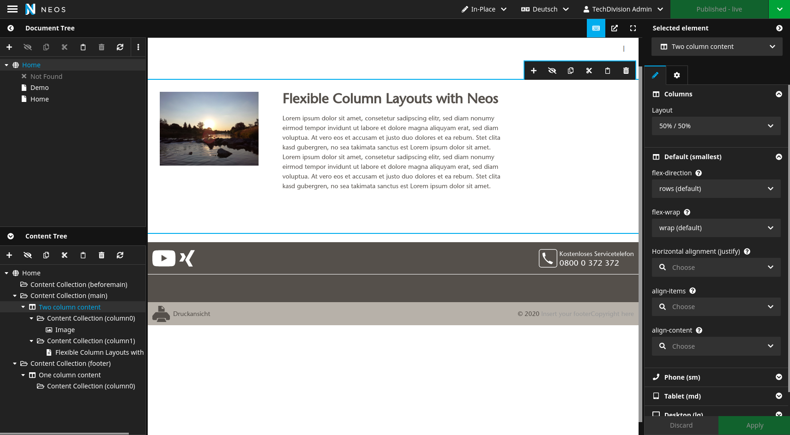
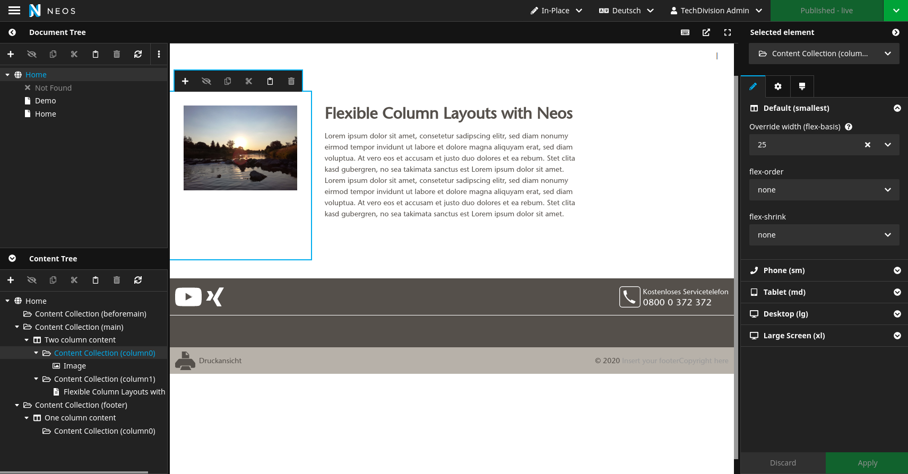

# Flex-ColumnLayouts for Neos CMS
Based on [TailwindCSS](https://tailwindcss.com/), but offers also css classes for [Bootstrap4](https://getbootstrap.com/docs/4.4/utilities/flex/).  
It extends your standard Neos-ColumnLayouts with flex properties so you can adjust every column with [css flex properties](https://css-tricks.com/snippets/css/a-guide-to-flexbox/).

## Get started
1. Install the package via packagist: Add `"techdivision/flexcolumnlayouts" : "~2.0"` to the require section of the composer.json or run `composer require techdivision/flexcolumnlayouts`.
2. If needed (i.e. nothing follow the instructions under "TailwindCSS" or "Bootstrap4"
3. Apply a node migration, if you want to use this feature on existing nodes. 

## For editors
You find a whole lot of settings now in your multi column nodes. 
We kept the css names instead of more speaking ones and added some links to an interactive documentation right in the inspector.
Flex is sometimes better understood if you [try it out](https://yoksel.github.io/flex-cheatsheet/).  

*Note: All the settings can be overidden per breakpoint.*


### NodeType level
Here you can see, how it looks like on NodeType level: You have plenty of options to adjust your columns



You have the following options for the whole grid  
* _Layout_: (as usual, but per breakpoint)  
like 50/50, 60/33 or similar
* [flex-direction](https://yoksel.github.io/flex-cheatsheet/#section-flex-direction) 
* [flex-wrap](https://yoksel.github.io/flex-cheatsheet/#section-flex-wrap)
* [justify-content](https://yoksel.github.io/flex-cheatsheet/#section-justify-content)
* [align-items](https://yoksel.github.io/flex-cheatsheet/#section-align-items-self)
* [align-content](https://yoksel.github.io/flex-cheatsheet/#section-align-content)

### Column level 

Here you can see, how it looks like on Column level: There you can override your options.




* Override width: Here you can override the width on a column-basis, so that you can have individual grids like 25/33 and dont have to add fixed layouts for that
* [flex-order](https://yoksel.github.io/flex-cheatsheet/#section-order)
* [flex-shrink](https://yoksel.github.io/flex-cheatsheet/#section-flex-shrink)
* Inline-Styles: background-color, text-color and background-image (experimental, just inline-styling - too specific to generalize)

### Principle
The idea behind this package is to have a full set of options for flex layouts available, so you can:
1. Do some experiments
2. Check which layouts improve experience, readability and layout on your website
3. Build new NodeTypes from that template

Having all those options at hand might be too complicated for some editors, but gives a great toolbox for advanced ones.

**We consider it rather useful for prototyping or advanced editors.**


## For developers

### TailwindCSS
If you already use tailwindcss in your project, you are all set and the classnames will be available to you.
If not, you have several choices:
1. (default) include the small css we deliver with this package which only include tailwind flex classnames 
2. include the latest [tailwind css build](https://tailwindcss.com/docs/installation) in your project (might be oversized)
3. include the scss files we provide in this package that produces tailwind-like classes
```scss
@import "Plugins/TechDivision.NodeTypes.FlexColumnLayouts/Resources/Private/Scss/TailwindFlexClasses";
```

### Bootstrap 4 & 5 Support
If you are using Bootstrap 4 or 5 in your project and have  [Flex Utilities 4](https://getbootstrap.com/docs/4.4/utilities/flex/)  or [Flex Utilities 5](https://getbootstrap.com/docs/5.0/utilities/flex/) available, you just have to:
* Add the small stylesheet 
`Resources/Public/Css/BootstrapAdditionalFlexClasses.css`  
to your page that adds some classes that bootstrap doesn't provide.
* Or include the scss file
```scss
@import "Plugins/TechDivision.NodeTypes.FlexColumnLayouts/Resources/Private/Scss/BootstrapAdditionalFlexClasses";
```
* For sure you need to add some fusion code to replace the tailwind classnames, which are a bit different:  
(For replacement, we have a mapping file, where you can see the differences: `Configuration/Settings.CssClassMapping.Bootstrap.yaml` 
```
prototype(TechDivision.NodeTypes.FlexColumnLayouts:MultiColumn) {
    containerClasses.@process.replaceClasses {
            expression = ${CssClassMapping.replace(value, 'bootstrap')}
            @position = 'end'
    }
    columns.itemRenderer.attributes.class.@process.replaceClasses {
            expression = ${CssClassMapping.replace(value, 'bootstrap')}
            @position = 'end'
    }
}
```

### Adding or Changing wrapper or column classes 

In case if you want wrap the Flex-Container you can easily add your desired class (in this case container-fluid or container) within the fusion for MultiColumn. Also you can add classes for Columns like this:
```
prototype(TechDivision.NodeTypes.FlexColumnLayouts:MultiColumn) {
    
    # add behaviour class and change wrapper class of wrapperClasses 
    wrapperClasses = Neos.Fusion:Join {
        wrapper = 'my-wrapper-class'
        behaviour = 'container-fluid'
        @glue = ' '
    }

    # add class to columns
    columns = Neos.Fusion:Collection {
        itemRenderer = Neos.Neos:ContentCollection {
            attributes = Neos.Fusion:Attributes {
                class = Neos.Fusion:Join {
                    theme = 'myThemeClass'
                    @glue = ' '
                }
            }
        }
    }

}
```


### Node Migration
In case you do not start with a fresh project, but want to have those features available on your existing multi-column containers as well, we provided you with a node migration:  
**Use with caution and only if you know what you are doing!**

```shell
./flow node:migrate 20200904150412
```

### Change breakpoint settings

If you include the scss files, you can overwrite the breakpoint variables defined by default:

```scss
$flexBreakpointConfiguration: (
        '640px': 'sm\\:',
        '768px': 'md\\:',
        '1024px': 'lg\\:',
        '1280px': 'xl\\:'
);
```

#### Remove/Adjust breakpoint 

To get rid of a breakpoint you just have to remove the breakpoint from SCCS and change the YAML configuration.

e.g. you want to remove the md breakpoint and edit some labels to increase the usability for the Editor
```yaml
'TechDivision.NodeTypes.FlexColumnLayouts:BreakpointsMixin':
  superTypes:
    'TechDivision.NodeTypes.FlexColumnLayouts:BreakpointsMixin.Md': false #disable mdBreakpoint
  ui:
    inspector:
      groups:
        defaultBreakpoint:
          label: 'Default (smallest)'
        smBreakpoint:
          label: 'Phone (sm) >= 576px' 
        lgBreakpoint:
          label: 'Tablet (lg) >= 992px' 
        xlBreakpoint:
          label: 'Desktop (xl) >= 1400px' 
```

## Disable flex-properties

On default all flex properties enabled. To provide a better usability for editors, you are able to deactivate them. 
Feel free to them them if you need one or more.

### Flex Grid (suggestion for editors)

```yaml
'Neos.NodeTypes.ColumnLayouts:Column':
  superTypes:
    'TechDivision.NodeTypes.FlexColumnLayouts:FlexContainer.Advanced': false
    'TechDivision.NodeTypes.FlexColumnLayouts:FlexJustifyMixin': true
```

Consider the loading order of your loaded packages!

### Flex Column (suggestion for editors)

```yaml
'TechDivision.NodeTypes.FlexColumnLayouts:FlexCollection':
  superTypes:
    'TechDivision.NodeTypes.FlexColumnLayouts:FlexCollection.Advanced': false
    'TechDivision.NodeTypes:Mixin.Layout': true
```

## Disable nesting of grids
```yaml
'TechDivision.NodeTypes.FlexColumnLayouts:FlexCollection':
  constraints:
    nodeTypes:
      'Neos.NodeTypes.ColumnLayouts:Column': false
```

Consider the loading order of your loaded packages!

## Contribution
If you want to contribute or found a bug, pls provide a PR or file an issue - or get in touch with us!
 
